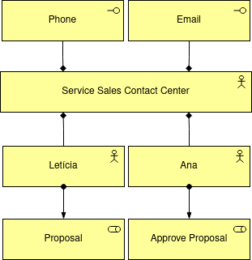

# Service Sales

This is an example project to demostrate the creation of a [Business Layer based on Archimate 3.1](https://pubs.opengroup.org/architecture/archimate3-doc/chap08.html) using Rebus to create a Business Service workflow.

## Cenario

### Business Interface

The Business Interface example describe a Service Sales Contact Center

### Business Service

The Business Service simulates a Proposal Creating Service with the following characteristics.

## Projects

[Rebus](https://github.com/rebus-org/Rebus)

[Topper](https://github.com/rebus-org/Topper)

[Serilog](https://github.com/serilog/serilog)
